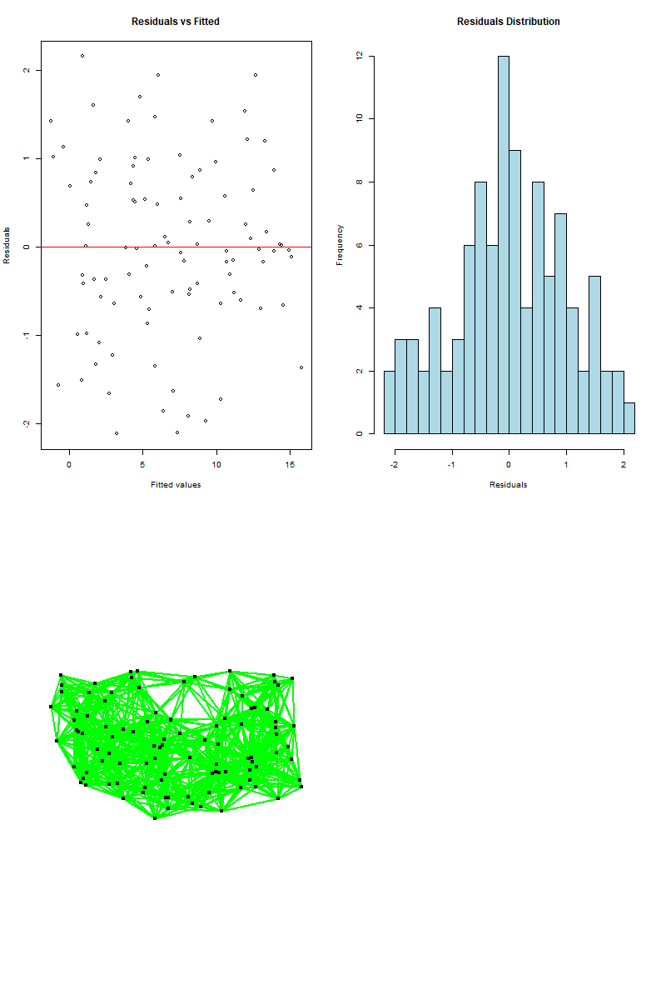

# Model Diagnostics Function (`model_diagnostics`)

The `model_diagnostics` function performs a comprehensive set of diagnostics for linear regression models (gaussian), including checks for homoscedasticity, residual distribution, multicollinearity, and spatial autocorrelation (SAC). Here’s how to interpret the outputs from the function:

## Function Usage

To run the diagnostics, use:

`model_diagnostics(model, longs, lats, k)`

Where:
- `model` is your regression model.
- `longs` and `lats` are vectors of longitude and latitude coordinates for spatial analysis (can be `NULL`).
- `k` is the number of nearest neighbors for spatial analysis (default is 5).

**Note**: The value of `k` should be chosen carefully to ensure that the neighborhood makes sense for your spatial analysis. It should reflect the spatial structure of your data to provide meaningful results.

## Outputs

### 1. Residuals vs Fitted Plot
- **Description**: This plot displays residuals against fitted values.
- **Interpretation**: Ideally, residuals should be randomly scattered around the horizontal line (y = 0). Patterns or trends may indicate non-constant variance (heteroscedasticity).

### 2. Residuals Distribution Histogram
- **Description**: A histogram of the residuals' distribution.
- **Interpretation**: The residuals should ideally follow a normal distribution. Skewness or kurtosis can indicate model misfit or non-normality in the residuals.

### 3. Multicollinearity Check
- **Description**: Displays Variance Inflation Factors (VIFs) for model predictors.
- **Interpretation**: High VIF values (generally > 10) suggest multicollinearity among predictors. This can affect the stability and interpretation of the model coefficients.

### 4. Spatial Autocorrelation (SAC) Check
- **Description**: If longitude (`longs`) and latitude (`lats`) are provided, the function performs a spatial autocorrelation check.
  
  - **Neighborhood Graph Symmetry**: Indicates whether the neighborhood graph is symmetric. Symmetry is a desirable property for spatial analysis.

  - **Spatial Weights Plot**: Visualizes the spatial neighbors used in the analysis.

  - **Moran's I Test Results**:
    - **Without Randomisation**: Moran's I statistic without randomisation. Positive values indicate positive spatial autocorrelation, while negative values suggest negative spatial autocorrelation. P values are calculated under the assumption of normality
    - **With Randomisation**: Moran's I statistic with randomisation. P values are calculated under the assumption of randomisation
    - **Two-Sided Test**: Moran's I statistic with a two-sided alternative hypothesis to test for both positive and negative spatial autocorrelation.
    - **Monte Carlo Test**: Moran's I statistic from the Monte Carlo simulation with a specified number of simulations (`nsim`). Provides an empirical p-value for the spatial autocorrelation.

If `longs` and `lats` are not provided, spatial autocorrelation results will not be computed, and the function will inform you of this.

